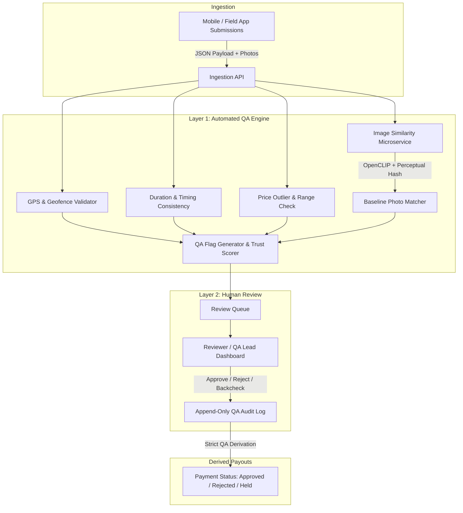

# Field Data Quality Assurance & Control (QA/QC) System

An automated verification, fraud detection, and reviewer approval platform for field data collection and mobile surveys.

This platform operates as the verification bridge between raw field submissions arriving via API and data approval / agent payouts. It pairs a **Layer 1 automated rule engine** with a **Layer 2 human-in-the-loop review dashboard**, ensuring all field data, GPS points, prices, and photos meet strict quality benchmarks.

---

## Key Highlights

- **Automated QA Rule Engine (Layer 1)**: Evaluates incoming submissions against configurable validation rules before human review.
- **Visual Baseline Verification**: Compares incoming field photos against registered outlet baselines using perceptual hashing (`imagehash`) and OpenCLIP vision embeddings to catch fraudulent or stale gallery photos.
- **Geofence & GPS Tolerance**: Validates submission GPS and photo-capture coordinates against strict outlet radii and quest-level geofences.
- **Anomaly & Fraud Detection**: Detects price outliers, survey duration anomalies (impossible completion speeds), and duplicate submissions.
- **Human Review & Audit Trail (Layer 2)**: Fast review queue with side-by-side visual comparisons, interactive Leaflet maps, and append-only decision logging with standardized reason codes.
- **Derived Payment Approval**: Agent payment status is strictly derived from QA decisions—ensuring payouts are only released for verified, high-quality data.
- **100% Local-First Architecture**: Built using open-source, self-hostable components without proprietary cloud dependencies (no external S3, cloud vision APIs, or managed message brokers required).

---

## System Architecture



---

## Tech Stack

| Component | Technologies |
| :--- | :--- |
| **Backend API** | Laravel 11/12 (PHP 8.3+), PostgreSQL, Laravel Sanctum, Spatie Permission |
| **Frontend Dashboard** | React 19, TypeScript, Vite, Tailwind CSS, TanStack Query, Leaflet, Recharts |
| **Image Service** | Python 3.11+, FastAPI, OpenCLIP, `imagehash`, PyTorch |
| **Orchestration** | Docker Compose, Local Filesystem Storage (`storage/app/public`), Database Queue Driver |

---

## Repository Structure

```text
.
├── backend/            # Laravel API, QA Rule Engine & Database Migrations
│   ├── app/Services/Qa/ # Automated rule implementations & scorers
│   ├── database/       # Migrations & seeders with baseline reference data
│   └── routes/api.php  # Ingestion & Review REST endpoints
├── frontend/           # React + TypeScript single-page dashboard
│   ├── src/pages/      # Review queue, QA overview, baseline management, etc.
│   ├── src/components/ # Side-by-side photo comparison, map views, badges
│   └── src/api/        # Axios API clients & sample test payloads
├── image-service/      # Python FastAPI microservice for image embeddings & pHash
├── docs/               # Reference payloads and test scenarios
└── docker-compose.yml  # Multi-container local orchestration
```

---

## Getting Started

### Option 1: Running with Docker Compose (Recommended)

1. **Clone the repository**:
   ```bash
   git clone https://github.com/Dagiayy/field-data-qa.git
   cd field-data-qa
   ```

2. **Configure environment files**:
   ```bash
   cp .env.example .env
   cp backend/.env.example backend/.env
   cp frontend/.env.example frontend/.env
   ```

3. **Start all services**:
   ```bash
   docker compose up -d --build
   ```

4. **Initialize database & reference data**:
   ```bash
   docker compose exec backend php artisan key:generate
   docker compose exec backend php artisan migrate --seed
   docker compose exec backend php artisan storage:link
   ```

5. **Access the services**:
   - **QA Dashboard**: [http://localhost:5173](http://localhost:5173)
   - **Backend API**: [http://localhost:8000/api](http://localhost:8000/api)
   - **Image Microservice**: [http://localhost:8001/docs](http://localhost:8001/docs)

---

### Option 2: Running Locally (Native Development)

#### 1. Backend (Laravel)
```bash
cd backend
composer install
cp .env.example .env
php artisan key:generate
# Configure DB credentials in backend/.env (PostgreSQL or SQLite)
php artisan migrate --seed
php artisan storage:link
php artisan serve
```

#### 2. Image Microservice (FastAPI)
```bash
cd image-service
python -m venv .venv
# On Windows: .venv\Scripts\activate | On Unix: source .venv/bin/activate
pip install -r requirements.txt
uvicorn main:app --host 0.0.0.0 --port 8001
```

#### 3. Frontend Dashboard (React + Vite)
```bash
cd frontend
npm install
npm run dev
```

---

## Verification & Test Scenarios

The repository includes pre-built test payloads in [`docs/`](docs/) and directly in the dashboard's **Test Ingestion** console (`/test-ingest`):

| Test Scenario | Purpose | Expected Outcome |
| :--- | :--- | :--- |
| **Clean Baseline Scan** | Single-item survey matching registered baseline photo and coordinates. | Passes automated checks (`status: pending` review without flags). |
| **Multi-Module Scan** | Complex submission with multiple modules, photos, and prices. | Tests repeat tables and multi-point photo analysis. |
| **Flagged Anomaly Scan** | Deliberate GPS drift, price outlier, fast completion time, and stale photo. | Rule engine generates specific `QAFlag` records for human reviewer action. |

### Running Backend Tests
A dedicated testing environment is configured to prevent accidental database resets:
```bash
docker compose run --rm --no-deps backend-test php artisan test
```

---

## Quality Dimensions & Rules

- **Location Consistency**: Checks GPS drift against baseline coordinates and verifies photos were taken on-site.
- **Photo Quality & Similarity**: Enforces minimum resolution (1280×720), analyzes blurriness, and scores similarity against reference spots.
- **Time Sequencing**: Validates survey duration against expected completion baselines and flags stale gallery photos.
- **Price Range Validation**: Compares SKU price inputs against statistical market ranges and historical medians.
- **Audit Logging**: Every manual approval, rejection, or backcheck is tracked with user attribution, timestamps, and reason codes.

---

## License

This project is open-source and available under the [MIT License](LICENSE).